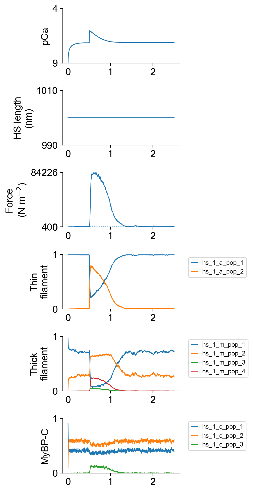
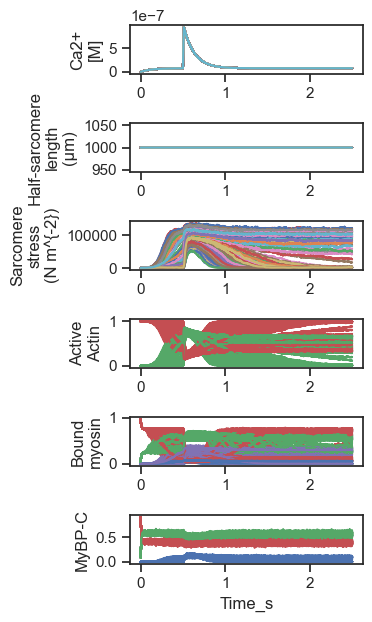

# Sampling of 1 variable

This dataset consists of n=100 isometric twitches simulated with 1 ms resolution.

Simulations were run with values of the following variables selected based on a Latin hypercube design.

| Variable | Description | Min value (multiple of base) | Max value (multiple of base) | Base value |
| --- | --- | --- | --- | --- |
| m_1_2_2_1 | A myosin rate constant | 10-0.5 | 100.5 | 200 |

In this example, m_1_2_2_1 ranged between 10-0.5 * 200 = 63 and 100.5 * 200 = 632.

## Example of a single trial

## 100 trials superposed

Note that for some parameter values, the muscle activated at low Ca2+ so that force rose early in the simulation and did not relax thereafter.

# Data

[Trace values](../../../simulations/summaries/summary_n_vars_1_part_1.txt) is a 2500 x 301 tab-delimited text file with columns arranged as follows:

+ Time (s)
+ Ca2+ conc (M) for sim 1
+ Half-sarcomere length (nm) for sim 1
+ Stress (N m-2) for sim 1
+ Ca2+ conc (M) for sim 2
+ Half-sarcomere length (nm) for sim 2
+ Stress (N m-2) for sim 2
+ Ca2+ conc (M) for sim 3
+ Half-sarcomere length (nm) for sim 3
+ Stress (N m-2) for sim 3
+ ...
+ Ca2+ conc (M) for sim 100
+ Half-sarcomere length (nm) for sim 100
+ Stress (N m-2) for sim 100
