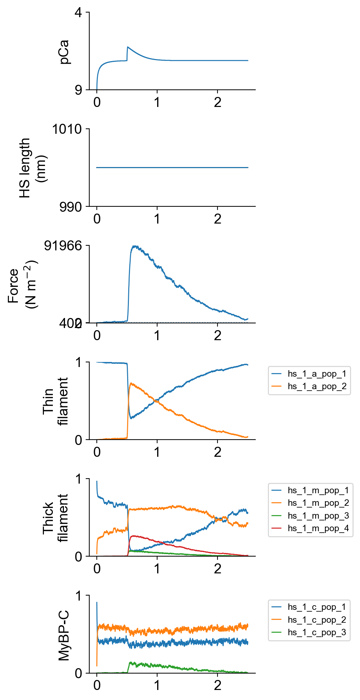
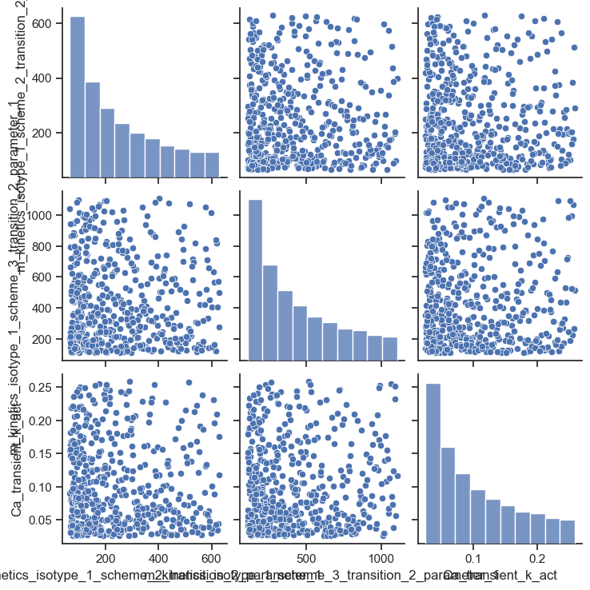
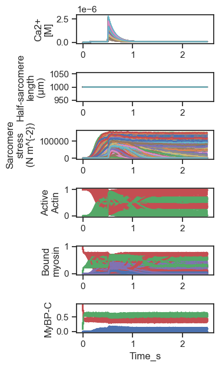

# Sampling of 3 variables

This dataset consists of n=500 isometric twitches simulated with 1 ms resolution.

Simulations were run with values of the following variables selected based on a Latin hypercube design.

| Variable | Description | Min value (multiple of base) | Max value (multiple of base) | Base value |
| --- | --- | --- | --- | --- |
| m_1_2_2_1 | A myosin rate constant | 10-0.5 | 100.5 | 200 |
| m_1_3_2_1 | A myosin rate constant | 10-0.5 | 100.5 | 350 |
| Ca_k_act | A rate constant for Ca2+ handling | 10-0.5 | 100.5 | 350 |

In this example, m_1_2_2_1 ranged between 10-0.5 * 200 = 63 and 100.5 * 200 = 632.

## How to generate these data

+ Follow the instructions for the [FiberSim demo](https://campbell-muscle-lab.github.io/FiberSim/pages/demos/sampling/latin_hypercube/latin_hypercube.html) but ...
+ ... run the command `python FiberPy.py sample "<path_to_this_repo>/simulations/n_vars_3/base/setup.json`

## Example of a single trial

## Pair-plot

This figure shows the distribution of the parameter values. The histogram has a concave profile because the rate constant was sampled in log space and drawn in linear space.

## 500 trials superposed

Note that for some parameter values, the muscle activated at low Ca2+ so that force rose early in the simulation and did not relax thereafter.

# Data

To keep files of manageable width, the 500 simulation traces are divided into 5 files, each containing records for 100 traces.

Each file is a 2500 x 301 tab-delimited text file with columns arranged as follows:

+ Time (s)
+ Ca2+ conc (M) for simulation n 
+ Half-sarcomere length (nm) for simulation n
+ Stress (N m-2) for simulation n
+ Ca2+ conc (M) for simulation n+1
+ Half-sarcomere length (nm) for simulation n+1
+ Stress (N m-2) for simulation n+1
+ Ca2+ conc (M) for simulation n+1
+ Half-sarcomere length (nm) for simulation n+1
+ Stress (N m-2) for simulation n+1
+ ...
+ Ca2+ conc (M) for simulation n+99
+ Half-sarcomere length (nm) for simulation n+99
+ Stress (N m-2) for simulation n+99

The links are:
+ [traces 1 to 100](data_files/summary_n_vars_3_part_1.txt)
+ [traces 101 to 200](data_files/summary_n_vars_3_part_2.txt)
+ [traces 201 to 300](data_files/summary_n_vars_3_part_3.txt)
+ [traces 301 to 400](data_files/summary_n_vars_3_part_4.txt)
+ [traces 401 to 500](data_files/summary_n_vars_3_part_5.txt)

[Parameter values](data_files/parameter_values.xlsx) is an Excel file where the nth row contains the parameter values for simulation n
